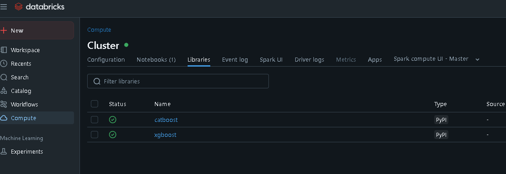
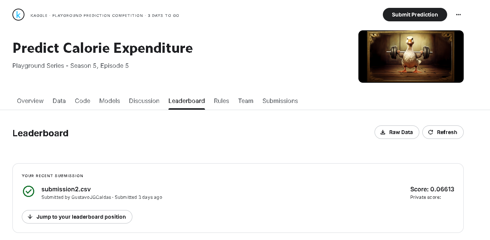

# 🏋️ Predict Calorie Expenditure  
**Kaggle Playground Series - Season 5, Episode 5**

This repository contains my solution for the Kaggle competition **"Playground Series - S5E5"**.  
The goal is to predict how many calories were burned during a workout session.

---

## 📝 Objective

Predict the number of **Calories** burned for each row in the test set.

### 🔢 Submission Format

The submission must be a CSV file with two columns: `id` and `Calories`. Example:

```
id,Calories
750000,93.2
750001,27.42
750002,103.8
```
---

## 📅 Timeline

- **Competition start**: May 1, 2025
- **Project Kickoff  | Initial exploration started**: May 19, 2025
- **Final submission deadline**: May 31, 2025 (11:59 PM UTC)

---

## ℹ️ Notes

- The dataset is **synthetically generated** but inspired by real-world data.  
- The competition is part of the **Kaggle Tabular Playground Series**, intended for learning and ex

---

## 🧰 Development Environment

This project was developed using **Databricks Community Edition**, combining **PySpark** and standard **Python** libraries.

To run the project successfully in Databricks:

1. Navigate to **Compute** → select the cluster you want to use  
2. Open the **Libraries** tab  
3. Click **Install New** → choose **PyPI**  
4. In the **Package** field, install:

```
xgboost
catboost
```



## 📊 Submission Result

Here is a screenshot showing my latest submission for the **Predict Calorie Expenditure** competition on Kaggle (Playground Series - Season 5, Episode 5):



This submission achieved a private score of **0.06613**, which reflects a solid performance in predicting calorie expenditure based on the provided features.

---

## 🧠 Model Overview

The model I used is an ensemble that combines **CatBoost** and **XGBoost** regressors, trained using **Stratified K-Fold cross-validation**. Below is a high-level explanation of the approach:

### 🛠️ Workflow Summary

1. **Data Preparation**:
   - Removed `id` and the target column `Calories` from the feature set.
   - Applied a logarithmic transformation (`log1p`) to the target to reduce skewness.
   - Discretized the `Duration` feature into quantile-based bins to stratify the data for cross-validation.

2. **Cross-Validation**:
   - Used `StratifiedKFold` with 5 folds, stratifying based on the binned `Duration`.
   - For each fold:
     - Trained a **CatBoostRegressor** on the training data.
     - Trained a **XGBRegressor** with tuned parameters.
     - Averaged the predictions from both models for validation and test data.

3. **Ensembling and Prediction**:
   - Combined predictions from CatBoost and XGBoost with a 50/50 weight.
   - Applied `expm1` to reverse the log transformation.
   - Clipped predictions between 1 and 314 to stay within realistic bounds.

### 🔧 Tools & Techniques

- `CatBoostRegressor`: Excellent with categorical features and requires minimal preprocessing.
- `XGBRegressor`: Highly optimized and flexible boosting method.
- `StratifiedKFold`: Ensures that each fold maintains similar distribution of the binned duration.
- `KBinsDiscretizer`: Converts a continuous feature into discrete bins for stratification.

---

This approach aims to blend the strengths of two powerful gradient boosting algorithms while using stratified folds to reduce variance and improve generalization.

